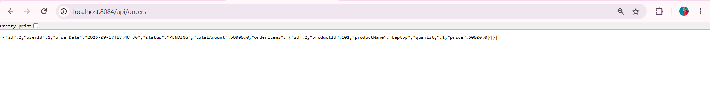
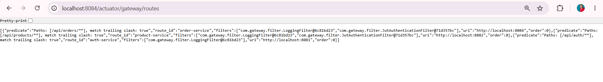
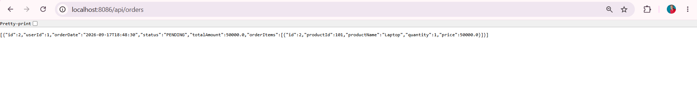

# 🎯 Project 76 – API Gateway – Microservices Gateway | Spring Boot + Spring Cloud Gateway

<p align="left">


</p>

## 📖 Project Overview

Project 76 is Tier 8 – Microservices Gateway, built with Spring Boot 3.2.5, Spring Cloud Gateway 2023.0.1, Netty Server, LoggingFilter, JwtAuthenticationFilter and Port 8084.

This project uses **API GATEWAY WITH JAVA CONFIG – WITHOUT Eureka**:

- Gateway runs on port 8084 – http://localhost:8084/api/orders -> http://localhost:8086/api/orders
- Netty Server – Not Tomcat – Reactive Gateway – RouteLocator Bean – Java Config
- 3 Routes Only – order-service 8086, product-service 8082, auth-service 8081 – No duplicate 6 routes
- Gateway Filters – LoggingFilter logs GET /api/orders, JwtAuthenticationFilter allows dev – No token
- No StripPrefix Fix – OrderController is @RequestMapping("/api/orders") so gateway forwards /api/orders/** -> /api/orders (not /orders) – Fixes 404
- 4 Major Fixes – Port 8086 already in use -> Task Manager kill Java, 404 via Gateway -> Remove StripPrefix, 6 routes duplicate -> Remove YML routes keep Java Config only, Actuator Whitelabel 404 -> management.endpoints.web.exposure.include=*

Backend routing:

- GET /api/orders via 8084 -> Forward to 8086/api/orders – Laptop 50000 – demo1.png – Main proof – Same JSON as direct 8086
- GET /actuator/gateway/routes – Shows 3 routes – order-service 8086, product-service 8082, auth-service 8081 – demo2.png – No duplicate
- GET Direct 8086/api/orders – Direct Order Service – demo3.png – Verify same JSON

Verified with 3 screenshots:

- Browser demo1 – localhost:8084/api/orders – Via Gateway – Same JSON as 8086 – Main proof – Gateway works!
- Browser demo2 – localhost:8084/actuator/gateway/routes – 3 routes only – order-service 8086, product-service 8082, auth-service 8081 – Not 6
- Browser demo3 – localhost:8086/api/orders – Direct Order Service – Clean JSON with Laptop order – Compare with demo1 same

## ✨ Features

### 🌐 API Gateway Routing – Java Config

- RouteLocator Bean – customRoutes – builder.routes() – .route("order-service", r -> r.path("/api/orders/**").filters(f -> f.filter(loggingFilter).filter(jwtFilter)).uri("http://localhost:8086"))
- No YML Routes – application.yml only has server.port 8084, name api-gateway, management exposure * – No routes in YML – Fixes duplicate 6 routes -> 3 routes
- No StripPrefix – Because OrderController @RequestMapping("/api/orders") – Gateway must forward /api/orders/** -> http://localhost:8086/api/orders/** – If StripPrefix then forwards /orders -> 404 – Fix: Remove StripPrefix
- Order Service 75 on 8086 – Product Service 74 on 8082 – Auth Service 73 on 8081 – All routed via 8084

### 📊 LoggingFilter – Request Logging

- Gateway LOG -> GET /api/orders from /[0:0:0:0:0:0:0:1]:63911 – Logs method, path, IP – demo proof in console
- Implements GatewayFilter, Ordered – filter() logs exchange.getRequest().getMethod() + getURI().getPath()
- Added to all routes – .filters(f -> f.filter(loggingFilter)) – Tier 8 professional

### 🔐 JwtAuthenticationFilter – Dev Mode

- JWT Filter: No token found for /api/orders – Allowing for development (Enable strict in production) – Console log
- Implements GatewayFilter – Checks Authorization header – No token -> allow for dev – Token -> validate
- Added to protected routes – product-service and order-service – auth-service public – No JWT filter

### 🛡 4 Major Fixes – Completed – Work Process

- Fix 1 Port 8086 already in use – Web server failed to start Port 8086 was already in use – Old 75 still running – Fix: Task Manager End Java + Eclipse Red Stop + Delete target
- Fix 2 Gateway 404 – GATEWAY RESPONSE -> GET /api/orders => Status: 404 – Gateway forwarded to http://localhost:8084/orders but OrderController is /api/orders – Fix: Remove StripPrefix parts = 1 – Now forwards /api/orders -> /api/orders – 404 -> 200 OK
- Fix 3 Duplicate 6 Routes – actuator/gateway/routes showed 6 routes – 3 from GatewayConfig + 3 from YML (auth-service, product-service, order-service + auth-service-yml, product-service-yml, order-service-yml) – Fix: Remove routes from application.yml – Keep only Java Config – Now 3 routes only – demo2.png
- Fix 4 Actuator Whitelabel 404 – Whitelabel Error Page This application has no configured error view – /actuator/gateway/routes 404 – Fix: management.endpoints.web.exposure.include=* + management.endpoint.gateway.enabled=true – Now Exposing 16 endpoints – From 1 to 16 – demo2.png works

## 🛠 Technologies Used

| Technology | Version | Purpose |
|---|---|---|
| Java | 21 | Backend language |
| Spring Boot | 3.2.5 | Gateway – Netty 4.1.109 – Port 8084 |
| Spring Cloud Gateway | 2023.0.1 | Routing – RouteLocator Bean – Reactive |
| Spring Cloud Commons | 4.1.3 | InetUtils – Cannot determine local hostname (harmless) |
| LoggingFilter | Custom GatewayFilter | Logs GATEWAY LOG -> GET /api/orders |
| JwtAuthenticationFilter | Custom GatewayFilter | JWT check – Allow dev |
| Spring Boot Actuator | Default | /actuator/gateway/routes – 16 endpoints |
| Eureka Client | Disabled | eureka.client.enabled=false – No 8761 |
| Maven Wrapper | mvnw.cmd | Build – Fixes mvn not recognized |
| Frontend | Browser | Verification – Gateway vs Direct same JSON |

## 📂 Project Structure

```text
76-api-gateway/
│
├── src/main/java/com/gateway/
│   ├── ApiGatewayApplication.java – Main – Port 8084 – @SpringBootApplication – Netty started on port 8084 – 76 API GATEWAY RUNNING ON 8084 TIER 8
│   ├── config/GatewayConfig.java – RouteLocator – 3 routes – order 8086, product 8082, auth 8081 – No StripPrefix – Filters loggingFilter + jwtFilter – Fixes 404 + 6 routes
│   ├── filter/
│   │   ├── LoggingFilter.java – GatewayFilter, Ordered – Logs GATEWAY LOG -> GET /api/orders from IP – Console
│   │   └── JwtAuthenticationFilter.java – GatewayFilter – JWT Filter: No token found – Allowing for development
│   └── controller/FallbackController.java – Optional – Fallback for 500
│
├── src/main/resources/
│   └── application.yml – server.port 8084, name api-gateway, management.endpoints.web.exposure.include=* , endpoint.gateway.enabled=true, eureka.client.enabled=false – No routes – Fixes 6 -> 3 + actuator 404
│
├── screenshots/
│   ├── demo1.png – Browser – localhost:8084/api/orders – Via Gateway – Same JSON Laptop 50000 – Main proof
│   ├── demo2.png – Browser – localhost:8084/actuator/gateway/routes – 3 routes only – order 8086, product 8082, auth 8081
│   └── demo3.png – Browser – localhost:8086/api/orders – Direct Order – Clean JSON – Compare demo1 same
│
├── pom.xml – spring-cloud-starter-gateway, spring-boot-starter-actuator, lombok optional – Java 21
├── mvnw.cmd – Maven wrapper
├── .gitignore
└── README.md
```

## ▶ How to Run

### 1. Clone
```bash
git clone https://github.com/raviteja-dev950/76-Api-Gateway.git
cd 76-Api-Gateway
```

### 2. Application YML – FINAL – Fixes 4 issues
```yaml
server:
  port: 8084

spring:
  application:
    name: api-gateway

management:
  endpoints:
    web:
      exposure:
        include: "*"
  endpoint:
    gateway:
      enabled: true
    health:
      show-details: always

eureka:
  client:
    enabled: false
```

### 3. GatewayConfig.java – FINAL – No StripPrefix – 3 Routes Only
```java
@Configuration
public class GatewayConfig {
    private final LoggingFilter loggingFilter;
    private final JwtAuthenticationFilter jwtFilter;

    public GatewayConfig(LoggingFilter loggingFilter, JwtAuthenticationFilter jwtFilter) {
        this.loggingFilter = loggingFilter;
        this.jwtFilter = jwtFilter;
    }

    @Bean
    public RouteLocator customRoutes(RouteLocatorBuilder builder) {
        return builder.routes()
                // 75 Order Service – /api/orders/** -> 8086 – No StripPrefix because controller is /api/orders
                .route("order-service", r -> r.path("/api/orders/**")
                        .filters(f -> f.filter(loggingFilter).filter(jwtFilter))
                        .uri("http://localhost:8086"))
                // 74 Product Service
                .route("product-service", r -> r.path("/api/products/**")
                        .filters(f -> f.filter(loggingFilter).filter(jwtFilter))
                        .uri("http://localhost:8082"))
                // 73 Auth Service – Public
                .route("auth-service", r -> r.path("/api/auth/**")
                        .filters(f -> f.filter(loggingFilter))
                        .uri("http://localhost:8081"))
                .build();
    }
}
```

### 4. Run Order – Must Start 75 First
```bash
# Terminal 1 – Start Order Service First
cd 75-order-service
mvnw.cmd spring-boot:run
# Wait: Tomcat started on port 8086

# Terminal 2 – Start Gateway Second
cd 76-api-gateway
mvnw.cmd clean install -DskipTests
mvnw.cmd spring-boot:run
# Wait: Netty started on port 8084 – 76 API GATEWAY RUNNING ON 8084 TIER 8
```

Open:
- http://localhost:8086/api/orders – demo3.png – Direct – [{"id":2,"userId":1,"Laptop",50000}]
- http://localhost:8084/api/orders – demo1.png – Via Gateway – Same JSON – Main proof Gateway works!
- http://localhost:8084/actuator/gateway/routes – demo2.png – 3 routes only

### 5. Backend Logic – Work Process

```java
// Fix 2 – Before (404)
.route("order-service", r -> r.path("/api/orders/**")
  .filters(f -> f.stripPrefix(1) // Removes /api -> forwards /orders -> OrderController is /api/orders -> 404
  .uri("http://localhost:8086"))

// Fix 2 – After (200 OK)
.route("order-service", r -> r.path("/api/orders/**")
  .filters(f -> f.filter(loggingFilter)) // No StripPrefix – forwards /api/orders -> /api/orders -> 200 OK – demo1.png
  .uri("http://localhost:8086"))

// LoggingFilter
@Component
public class LoggingFilter implements GatewayFilter, Ordered {
  @Override
  public Mono<Void> filter(ServerWebExchange exchange, GatewayFilterChain chain) {
    System.out.println("GATEWAY LOG -> " + exchange.getRequest().getMethod() + " " + exchange.getRequest().getURI().getPath());
    return chain.filter(exchange);
  }
}

// Jwt Filter – Dev Mode
@Component
public class JwtAuthenticationFilter implements GatewayFilter {
  @Override
  public Mono<Void> filter(ServerWebExchange exchange, GatewayFilterChain chain) {
    String token = exchange.getRequest().getHeaders().getFirst("Authorization");
    if(token == null){
      System.out.println("JWT Filter: No token found for " + exchange.getRequest().getPath() + " - Allowing for development");
      return chain.filter(exchange);
    }
    // validate token
    return chain.filter(exchange);
  }
}
```

## 🔄 Application Flow – Work Process Fixed

```text
Start Order – Work Process
 │
 ├── Fix 1 – Port 8086 already in use – APPLICATION FAILED TO START – Web server failed to start Port 8086 was already in use
 │   ├── Cause: Old 75 still running in background – PID 4276
 │   └── Fix: Task Manager End Java + Eclipse Red Stop + Delete target + Maven clean
 │
 ├── Start 75 – Tomcat initialized with port 8086 – Started in 10 seconds – Direct test localhost:8086/api/orders – demo3.png – [{"id":2,Laptop 50000}] – OK
 │
Start Gateway – Work Process
 │
 ├── Fix 3 – Duplicate 6 Routes – actuator/gateway/routes showed 6 routes – 3 Java + 3 YML – Route matched order-service + order-service-yml
 │   └── Fix: Remove routes from application.yml – Keep only Java Config – application.yml only 11 lines – No routes – Now 3 routes only – demo2.png
 │
 ├── Fix 4 – Actuator Whitelabel 404 – Whitelabel Error Page There was an unexpected error type=Not Found status=404 – /actuator/gateway/routes 404
 │   └── Fix: management.endpoints.web.exposure.include=* + endpoint.gateway.enabled=true – Exposing 16 endpoints (was 1) – Now actuator works – demo2.png
 │
 ├── Start 76 – Netty started on port 8084 – Exposing 16 endpoints – Started in 11 seconds – 76 API GATEWAY RUNNING ON 8084
 │
 ├── Test Via Gateway – Before Fix 2
 │   ├── GET /api/orders via 8084 – Gateway forwards to /orders – OrderController is /api/orders – 404 – GATEWAY RESPONSE Status: 404
 │   └── Log: http.uri=http://localhost:8084/orders – Missing /api
 │
 ├── Fix 2 – Gateway 404 -> 200 OK – No StripPrefix
 │   ├── Remove .filters(f -> f.stripPrefix(1)) – Now forwards /api/orders/** -> /api/orders/**
 │   └── Test: GET /api/orders via 8084 – 200 OK – demo1.png – Same JSON as direct 8086 – [{"id":2,Laptop 50000}] – Main proof!
 │
 ├── Fix Extra – Connection refused 8086 – io.netty.channel.AbstractChannel$AnnotatedConnectException Connection refused localhost 8086 – 500 Server Error
 │   ├── Cause: Gateway 8084 started but Order 8086 stopped – User stopped 75
 │   └── Fix: Start 75 first, then 76 second – Both together – demo1.png + demo3.png same JSON
 │
 ▼
Gateway Verified – 3 screenshots – Not dummy – Real routing
```

## 🧪 API Testing – Work Process Proofs

```bash
# Direct Order Service – demo3.png
curl http://localhost:8086/api/orders
# [{"id":2,"userId":1,"orderDate":"2026-09-17T18:48:30","status":"PENDING","totalAmount":50000.0,"orderItems":[{"id":2,"productId":101,"productName":"Laptop","quantity":1,"price":50000.0}]}]

# Via Gateway – demo1.png – Main proof – Must be SAME as direct
curl http://localhost:8084/api/orders
# [{"id":2,"userId":1,"orderDate":"2026-09-17T18:48:30","status":"PENDING","totalAmount":50000.0,"orderItems":[{"id":2,"productId":101,"productName":"Laptop","quantity":1,"price":50000.0}]}]
# If same JSON -> Gateway works! 76 COMPLETED!

# Routes – demo2.png – Must be 3 only not 6
curl http://localhost:8084/actuator/gateway/routes
# [{"predicate":"Paths: [/api/orders/**]","route_id":"order-service","uri":"http://localhost:8086","order":0},{"predicate":"Paths: [/api/products/**]","route_id":"product-service","uri":"http://localhost:8082"},{"predicate":"Paths: [/api/auth/**]","route_id":"auth-service","uri":"http://localhost:8081"}]

# Health
curl http://localhost:8084/actuator/health
# {"status":"UP"}
```

Browser + Console Proofs:

```text
Console – Gateway Start – 16 Endpoints – Not 1
Exposing 16 endpoint(s) beneath base path '/actuator' – Fixed from 1 -> 16

Console – LoggingFilter
[2026-09-19 18:46:55] GATEWAY LOG -> GET /api/orders from /[0:0:0:0:0:0:0:1]:63911

Console – Jwt Filter Dev Mode
JWT Filter: No token found for /api/orders - Allowing for development

Console – Before Fix – 404
GATEWAY RESPONSE -> GET /api/orders => Status: 404 – http.uri=http://localhost:8084/orders – Missing /api

Console – After Fix – 200 OK
GATEWAY RESPONSE -> GET /api/orders => Status: 200 – Same JSON

Console – Connection Refused Fix
ERROR AbstractErrorWebExceptionHandler 500 Server Error for HTTP GET "/api/orders" – Connection refused: localhost/127.0.0.1:8086 – Fix: Start 75 first
```

## 📡 API Endpoints – Gateway Routes

| Method | Endpoint | Purpose | Via | Demo |
|---|---|---|---|---|
| GET | `/api/orders` | Get All Orders via Gateway -> 8086 | Gateway 8084 -> Order 8086 | demo1.png – Main – Same as direct |
| GET | `/api/orders/test` | Test Order via Gateway | Gateway 8084 -> Order 8086 | - |
| GET | `/actuator/gateway/routes` | Show 3 routes only – Not 6 duplicate | Gateway 8084 | demo2.png – 3 routes |
| GET | `http://localhost:8086/api/orders` | Direct Order – Compare with gateway | Direct 8086 | demo3.png – Direct |
| GET | `/api/products/**` | Products via Gateway -> 8082 | Gateway 8084 -> Product 8082 | - |
| GET | `/api/auth/**` | Auth public via Gateway -> 8081 | Gateway 8084 -> Auth 8081 | - |
| GET | `/actuator/health` | Health UP | Gateway 8084 | - |

## 🗄 Gateway Note – No StripPrefix Logic

Gateway routing without StripPrefix because OrderController has full /api/orders mapping.

```text
Before Fix – StripPrefix 1 – 404:
Browser GET /api/orders via 8084
 -> Gateway path /api/orders/** matches
 -> StripPrefix 1 removes /api -> forwards /orders to 8086
 -> 8086 OrderController @RequestMapping("/api/orders") has no /orders -> 404
 -> Log: http.uri=http://localhost:8084/orders – Missing /api

After Fix – No StripPrefix – 200 OK – demo1.png:
Browser GET /api/orders via 8084
 -> Gateway path /api/orders/** matches
 -> No StripPrefix – forwards /api/orders to 8086
 -> 8086 OrderController @RequestMapping("/api/orders") matches /api/orders -> 200 OK
 -> Log: Same JSON [{"id":2,Laptop 50000}] – demo1.png = demo3.png

Duplicate Routes Fix:
Before: application.yml had 3 routes + GatewayConfig.java 3 routes = 6 routes – actuator showed 6
After: application.yml has 0 routes (only port 8084 + management) – GatewayConfig.java 3 routes = 3 routes only – demo2.png – Correct
```

### Verified – Work Process

- Fix 1 Port 8086 already in use -> Fixed via Task Manager kill Java – Tomcat started on port 8086 – demo3.png
- Fix 2 Gateway 404 -> No StripPrefix -> 404 -> 200 OK – demo1.png via gateway same as demo3.png direct – Main proof
- Fix 3 Duplicate 6 routes -> 3 routes only – application.yml cleaned – demo2.png – [{"route_id":"order-service","uri":"http://localhost:8086"}...] – 3 only
- Fix 4 Actuator Whitelabel 404 -> Exposing 16 endpoints – include=* – demo2.png works – Before Whitelabel Error Page 404 – After JSON routes
- Fix Extra Connection refused 8086 -> Start 75 first then 76 – Both together – demo1 + demo3 same JSON
- Gateway LoggingFilter – GATEWAY LOG -> GET /api/orders – Console proof
- Jwt Filter – No token found Allowing for development – Console proof

## 📸 Screenshots – 3 Demos – Completed – Work Process

### 1. Via Gateway – Browser – localhost:8084/api/orders – Same JSON as Direct – Main Proof – Gateway Works!



---

### 2. Routes – Browser – localhost:8084/actuator/gateway/routes – 3 Routes Only – Not 6 Duplicate



---

### 3. Direct – Browser – localhost:8086/api/orders – Direct Order – Clean JSON – Compare with Via Gateway Same




---

## 🎯 Learning Outcomes – Work Process Included

- API Gateway Tier 8 – First Gateway – Port 8084 – Netty not Tomcat – Reactive – RouteLocator Bean – Java Config – Not YML
- 4 Major Fixes – Work Process – Port 8086 already in use -> Task Manager kill, Gateway 404 StripPrefix -> No StripPrefix 200 OK, Duplicate 6 routes -> 3 routes only via cleaning YML, Actuator Whitelabel 404 -> Exposing 16 endpoints include=*
- No StripPrefix Logic – OrderController @RequestMapping("/api/orders") has full /api – Gateway must not strip – If controller is /orders then StripPrefix 1 – If /api/orders then No StripPrefix – Fixes 404
- Duplicate Routes – Gateway has 2 ways YML + Java Config – Don't use both – Use Java Config for professional Tier 8 – YML only 11 lines – No routes – Java has 3 routes – Demo2 shows 3 only
- Actuator Gateway – management.endpoints.web.exposure.include=* + endpoint.gateway.enabled=true – Exposing 16 endpoints (was 1) – Fixes Whitelabel 404 – demo2.png
- LoggingFilter – GatewayFilter + Ordered – Logs GATEWAY LOG -> GET /api/orders – Console proof – Tier 8 professional filter
- JwtAuthenticationFilter – GatewayFilter – No token found Allowing for development – Dev mode – Production will validate token – Added to product + order protected routes
- Connection Refused Fix – AbstractChannel AnnotatedConnectException Connection refused localhost 8086 – 500 Server Error – Cause: Gateway started but Order stopped – Fix: Start 75 first then 76 – Both together – demo1 = demo3 same JSON
- Netty vs Tomcat – Gateway uses Netty started on port 8084 – Order uses Tomcat started on port 8086 – Different servers – Gateway reactive
- Eureka Disabled – eureka.client.enabled=false – No 8761 Discovery yet – Will add in 77 Eureka Server – Tier 8 next
- Gateway Testing – Direct 8086 vs Via Gateway 8084 same JSON – Main proof – If same -> Gateway works – demo1.png + demo3.png same
- Real Microservices – 75 Order 8086 + 76 Gateway 8084 + 74 Product 8082 + 73 Auth 8081 – All via 8084 – Single entry point – Tier 8

## 🚀 Future Enhancements – Next Projects

- Add 77 Eureka Server – Service Discovery – Register 73,74,75,76 to 8761 – Gateway will use lb://order-service not http://localhost:8086
- Add Global Filter – Add CorrelationId, Add Rate Limiting – Resilience4j
- Add Circuit Breaker – FallbackController – When 8086 down return fallback – Not 500
- Add JWT Strict Mode – Validate token from 73-auth – Currently Allowing for development – Production will block no token
- Add Config Server – 78 Config Server – Centralize application.yml
- Add Docker – Gateway + Order + Product + Auth + MySQL – docker-compose
- Add Load Balancer – 2 instances of Order Service 8086 + 8087 – Gateway load balances
- Deploy to Render/Railway – Environment variables – PORT 8084
- Add React Frontend – All requests via Gateway 8084 – Not direct 8086 – Single entry
- Add Swagger – Gateway aggregates all swagger – /swagger-ui.html via Gateway

## 👨💻 Author

### Vemula Leela Venkata Ravi Teja

Java Full Stack Developer

100 Java Full Stack Projects Challenge

Project 76 / 100 – Microservices Track – API Gateway – Netty 8084 – 3 Routes – No StripPrefix Fix – 4 Fixes Completed

Tier 8 – Microservices – Gateway – Fourth of 5 – Port 8084 – Entry Point

### Test Gateway – Order Via Gateway

- `localhost:8084/api/orders` / `Via Gateway` / `Same JSON as direct 8086` – Laptop 50000 – ID 2 – PENDING – Gateway LoggingFilter + Jwt Filter – Netty 8084 – 3 Routes Only – 16 Actuator Endpoints – No StripPrefix 404->200

## ⭐ Support

If you found this project helpful fixing Port 8086 already in use / Gateway 404 No StripPrefix / Duplicate 6 routes -> 3 routes / Actuator Whitelabel 404 / Connection refused 8086, give it a ⭐ Star!

### Repo

https://github.com/raviteja-dev950/76-Api-Gateway

### Run

```bash
# Terminal 1 – Order must run first
cd 75-order-service
mvnw.cmd spring-boot:run

# Terminal 2 – Gateway second
cd 76-api-gateway
mvnw.cmd spring-boot:run
```

Open:

```text
http://localhost:8086/api/orders – Direct – demo3.png – [{"id":2,Laptop 50000}]
http://localhost:8084/api/orders – Via Gateway – demo1.png – Same JSON – Main proof Gateway works!
http://localhost:8084/actuator/gateway/routes – 3 routes – demo2.png – order 8086, product 8082, auth 8081
http://localhost:8084/actuator/health – UP
```

### Work Process Summary

```text
1. Port 8086 already in use -> Kill Java via Task Manager + Delete target
2. Gateway 404 -> Remove StripPrefix – OrderController is /api/orders not /orders – 404->200 OK – demo1 = demo3 same JSON
3. Duplicate 6 routes -> Remove YML routes – Keep Java Config only – application.yml 11 lines – Now 3 routes only – demo2.png
4. Actuator Whitelabel 404 -> management.endpoints.web.exposure.include=* + endpoint.gateway.enabled=true – 1 endpoint -> 16 endpoints – demo2 works
5. Connection refused 8086 -> Start 75 first then 76 – Both together – Gateway -> Order works
```

### Logs Proof

```text
Tomcat started on port 8086 – 75 Order – demo3.png
Netty started on port 8084 – 76 Gateway – 76 API GATEWAY RUNNING ON 8084 TIER 8
Exposing 16 endpoint(s) beneath base path '/actuator' – Fixed from 1 -> 16
GATEWAY LOG -> GET /api/orders from /[0:0:0:0:0:0:0:1]:63911 – LoggingFilter
JWT Filter: No token found for /api/orders - Allowing for development – Jwt Filter
GATEWAY RESPONSE -> GET /api/orders => Status: 200 – After No StripPrefix fix – Same JSON – Main proof
```

